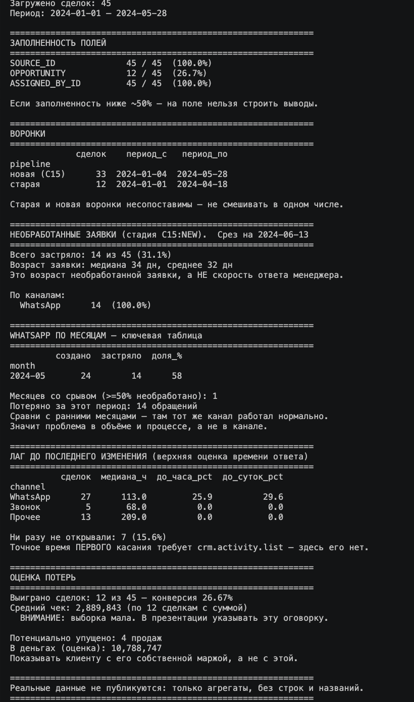

# Анализ обработки заявок в Bitrix24

Аналитический проект: поиск причин потери входящих обращений в CRM
торговой компании. Реальные данные не публикуются — в репозитории
только код и синтетический пример с той же структурой.

## Задача

У компании падала конверсия входящих обращений. Гипотез было много
(«канал плохой», «менеджеры медленные»), но подтверждались они
ощущениями, а не данными. Нужно было по выгрузке сделок из Bitrix24
ответить: где именно теряются заявки и что это за потеря — канал,
люди или процесс.

## Данные

Выгрузка `crm.deal.list` из Bitrix24 REST API: **~17,6 тыс. сделок**
за три года. Поля: источник, стадия, даты создания и изменения,
ответственный, сумма. Персональных данных, названий и сумм в
репозитории нет — см. раздел «Данные и приватность».

## Выводы (обезличенно)

- Около **четверти всех заявок** застряло на стадии «Новая» и не было
  обработано вовсе; медианный возраст такой заявки — свыше полугода.
- Три четверти застрявших пришли из **WhatsApp-канала**.
- Помесячная разбивка показала: в ранние месяцы тот же канал
  обрабатывался почти полностью (доля необработанных — единицы
  процентов), а затем несколько месяцев подряд необработанными
  оставались **более 85% обращений**. Вывод: проблема не в канале,
  а в срыве процесса при росте объёма.
- Поле суммы сделки заполнено менее чем в 1% строк — денежную оценку
  потерь можно давать только как порядок величины с оговорками.

Отдельная часть работы — честность метрик: `DATE_MODIFY` — это не
«скорость ответа», а лишь верхняя оценка; точка отсчёта — максимальная
дата в данных, а не `now()`; медиана вместо среднего из-за длинного
хвоста; старая и новая воронки не смешиваются.

## Как запустить

```bash
pip install -r requirements.txt
python generate_sample.py   # создаёт sample_data.csv (уже лежит в репо)
python analyze.py           # анализ sample_data.csv
```

Свои данные:

```bash
python analyze.py path/to/deals.xlsx
```

Выгрузка напрямую из Bitrix24 (токен — только в окружении,
см. `.env.example`):

```bash
export BITRIX_WEBHOOK="https://<portal>.bitrix24.<tld>/rest/<user_id>/<token>/"
python analyze.py --fetch
```
   
## Структура

```
analyze.py           # точка входа: загрузка → подготовка → отчёты
generate_sample.py   # генератор синтетического датасета
sample_data.csv      # синтетический пример (45 строк, значения выдуманы)
src/
  config.py          # правила классификации каналов, пороги
  fetch.py           # постраничная выгрузка из Bitrix24 REST API
  prepare.py         # производные поля, проверка заполненности
  reports.py         # отчёты: воронки, застрявшие, помесячная таблица, потери
```

## Данные и приватность

Реальная выгрузка и любые csv/xlsx/json закрыты в `.gitignore`
(исключение — `sample_data.csv`). Токен API живёт только в переменной
окружения `BITRIX_WEBHOOK`. В коде и README нет названий компаний,
имён, контактов и конкретных сумм — только доли и порядки величин.

## Стек

Python, pandas, numpy, Bitrix24 REST API (crm.deal.list), openpyxl, requests.
